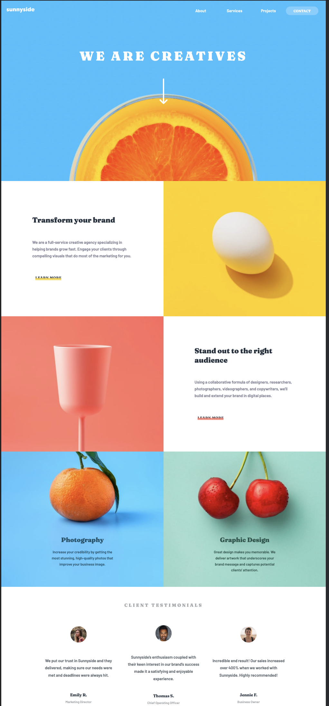

 Frontend Mentor: SunnySide Agency Landing Page

This is my solution to the [SunnySide Agency Landing Page Project](https://www.frontendmentor.io/challenges/sunnyside-agency-landing-page-7yVs3B6ef/hub/sunnyside-agency-landing-page-RWNxnL7EG). Frontend Mentor challenges help you improve your coding skills by building realistic projects.

## Table of contents

- [Overview](#overview)
- [The challenge](#the-challenge)
- [Screenshot](#screenshot)
- [Built with](#built-with)
- [What challenged me](#what-challenged-me)
- [What I learned](#what-I-learned)
- [Useful resources](#useful-resources)
- [Author](#author)
- [Acknowledgments](#acknowledgments)

## Overview

### The challenge

The challenge is to build out this landing page and get it looking as close to the design as possible.

One can use any tools you like to help you complete the challenge. So if you've got something you'd like to practice, feel free to give it a go.

**Users should be able to:**

-View the optimal layout for the site depending on their device's screen size
-See hover states for all interactive elements on the page

### Screenshot

This is a screenshot for a laptop size screen,  mobile screen as well as mobile screen with navbar open  respectively . I had issues setting up the background image on different screens but I eventually came up with this.

### Links

- Solution URL: [Here's a link to my solution on Frontend Mentor](https://www.frontendmentor.io/solutions/using-both-flexbox-and-grid-layouts-styled-with-sass-6iWudO1w1).
- Live Site URL: [And here's the page live in action](https://sunnyside-agency-1u3o8zs4f-hcmwebs.vercel.app/)

### Built with

- HTML5 markup
- [CSS Grid](https://css-tricks.com/look-ma-no-media-queries-responsive-layouts-using-css-grid/)
- [CSS Flexbox](https://css-tricks.com/snippets/css/a-guide-to-flexbox/)
- [Mobile-first design](https://css-tricks.com/how-to-develop-and-test-a-mobile-first-design-in-2021/)
- [Sass](https://sass-lang.com/dart-sass)

### What challenged me!
- I decided to use picture element on all the **images** something I had never done before.

-SVG images are always tricky to me.
### What I learned

- I learnt more about picture element and had a lot of fun when all seemed to work well.

- I am happy with my evolution with SVG images.

- I am getting more deeper into sass.

- It is always fun to work with both grid and flex layouts.

### Useful resources

- [Google](https://www.google.com) - Definately **THE** most valuable tool in a web developer's **TOOLBOX**, frontend or backend. Any search engine would do, though.
- [CSS Tricks](https://css-tricks.com/) - This is one of my go-to platforms. It is full of articles that are clearly and broadly explained by people with vast knowledge of CSS.

- [Stack overflow](https://stackoverflow.com/) - A place where all the developer questions have already been answered by fellow developers.

## Author

- [hcmwebs](https://www.hcmwebs.com/)
- Frontend Mentor - [@hcmwebs](https://www.frontendmentor.io/profile/hcmwebs)
- Twitter - [@hcmwebs](https://twitter.com/hcmwebs)

## Acknowledgments

- [Frontend Mentor](https://www.frontendmentor.io)
